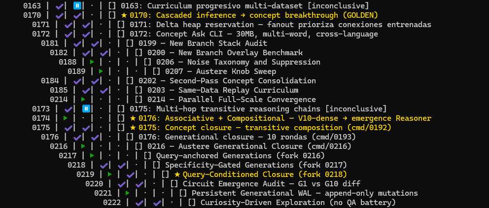

# Research Tree

**Research is a graph. Your logbook shouldn't be a flat file.**

Research Tree maps engineering research as a directed acyclic graph
(DAG). Every node is a unit of research — an idea, a claim, an experiment, a
decision — connected by epistemic edges (parent, continuation, supersession).

It replaces linear research logs (logbooks, lab notebooks, markdown dumps)
with a structured, queryable, and auditable knowledge graph.

**Stack:** Go standard library + `cobra` (CLI).  
**Storage:** `.research/` directory — no database, no server, no daemon.  
**License:** MIT. See `LICENSE`.

---

## Project status

Research Tree is a personal tool, **released as-is** under MIT. Fork or vendor
if you need a stable dependency. Bug reports and patches reviewed
opportunistically. See `SUPPORT.md` for the full maintenance policy.

```
0001 Hypothesis: sparse KD can recover recall
├─ 0002 Run: k=64 baseline [failure]
├─ 0003 Run: k=128 improved [success] ★ champion
│  └─ 0012 Poisoned: bad checkpoint ☣
└─ 0011 Revalidated: clean rerun ♻
0020 Inspired by 0001 — compares_against
```

---

## Why this exists

Linear logs break down the moment research branches. You start with a
hypothesis, run an experiment, pivot, fork, abandon a path, revisit it three
weeks later. A flat text file can't answer:

- Which claims are still provisional? Which have been invalidated?
- What experiment produced this result, on which host, with what command?
- What did this node look like before I changed my mind?
- What depends on this assumption?

Research Tree gives you a DAG, not a timeline. Every node knows its parents,
its children, its continuations, and its replacements. You navigate the
structure of your thinking, not the order you typed it in.

> It was born from tracking 19+ sequential log files during LLM prompt
> research. When backtracking to a three-week-old experiment took longer than
> running it again, the tool became necessary.



---

## Five minutes to your first graph

```bash
# 1. Start a research project
rt init

# 2. Create a research node
rt node create --title "Hypothesis: larger context windows improve recall"

# 3. Claim hardware and log an experiment run
rt resource add --id ctx-gpu0 --label "gpu-node-3 gpu0" --kind gpu \
  --endpoint gpu03.int.lab --endpoint-kind dns --tags cuda,24gb
rt resource claim 1 ctx-gpu0 --by codex --note "longqa baseline"
rt node logrun 1 \
  --resource-id ctx-gpu0 \
  --endpoint gpu03.int.lab \
  --endpoint-kind dns \
  --cmd "python eval.py --ctx 8192 --dataset longqa" \
  --outdir /tmp/run-001 \
  --seed 42 \
  --note "baseline: 8k context, standard attention"

# 4. Validate the claim with evidence
rt node close 1 --outcome success \
  --append-body "8k context improved recall by +12% over 4k baseline."

# 5. See what happened
rt feed --hours 24
rt resource history ctx-gpu0
rt tree
rt status
```

**That's the core loop:** hypothesis → experiment → evidence → conclusion.
Every step is a node. Every connection is explicit. Nothing is lost.

---

## The mental model

| Concept | What it means |
|---------|---------------|
| **Node** | A unit of research: claim, experiment, decision, or observation |
| **Parent** | What prior work does this depend on? (epistemic dependency) |
| **Claim** | A falsifiable statement. Starts `provisional`, ends `validated`, `invalidated`, or `superseded` |
| **Run** | A concrete experiment execution: resource, endpoint, command, outdir, seed, validity |
| **Resource** | A declared machine/GPU/cpu-slot with stable `id`, human `label`, and technical `endpoint` |
| **Lease** | A live occupancy claim from one node to one resource |
| **Artifact** | A file or dataset attached to a node (linked or embedded) |
| **Supersede** | A claim replaced by a better one — preserves both, with a traceable edge |
| **Continue** | A long investigation split across nodes — keeps the thread alive |
| **Relation** | A typed cross-edge: `compares_against`, `inspired_by`, `depends_on`, `aggregates` |
| **Primary parent** | Designated canonical parent when a node has multiple DAG parents |
| **Poison** | Flag a node's evidence as untrustworthy — propagates downstream via `rt doctor` |
| **Revalidate** | Restore trust in previously poisoned evidence |

A node with `continued_by=[7]` says "this work isn't done, node 7 picks it
up." A claim with `superseded_by=[12]` says "this conclusion was valid at the
time, but node 12 has a better one." A node with `--relation compares_against:5`
links to a baseline without polluting the parent lineage. No information is destroyed.

---

## Key features

- **DAG, not a tree.** A node can have multiple parents from different
  branches. Ideas merge, and the graph reflects that.
- **Claims with lifecycle.** `provisional` → `validated` | `invalidated` →
  `superseded`. Every transition is evidence-gated.
- **Experiment runs.** Structured run records with resource, endpoint, command, outdir,
  seed, ETA, cost, and validity.
- **Resource coordination.** Explicit inventory plus active leases prevent
  agents from double-booking the same machine or GPU.
- **Revision history and diffs.** Every update creates a revision. `rt node
  diff 42 --rev-a 3 --rev-b 7` shows exactly what changed.
- **Chronological feed.** `rt feed --hours 24 --status done` gives you a time-
  sorted activity view without losing the graph structure.
- **JSON output.** Every command supports `--json` for scripting, dashboards,
  and agent integration.
- **Zero dependencies at rest.** Everything is a directory on disk. No
  database, no server, no daemon. Back up with `rsync`.
- **Agent-ready.** Both a Go ABI (`pkg/retree`) and a structured CLI for
  external tooling. Designed to be embedded.
- **Typed relations.** Beyond parent-child: `compares_against`, `inspired_by`,
  `depends_on`, and `aggregates` keep the DAG clean without abusing `--parents`.
- **Evidence hygiene.** Mark nodes as `poisoned` when evidence becomes unreliable,
  `revalidate` when trust is restored. `rt doctor evidence` traces contamination.
- **Structural diagnostics.** `rt lint` audits hygiene; `rt doctor lineage`
  surfaces multi-parent patterns, poisoned ancestors, and missing primary parents.

---

## Install

```bash
go install github.com/frudas24/research-tree/cmd/rt@latest
```

Binary lands in `$GOPATH/bin/rt`. Add it to your PATH.

Or build from a clone:

```bash
go install ./cmd/rt
```

To build locally:

```bash
make build          # -> build/rt
make libretree.so   # -> build/libretree.so + build/libretree.h
```

Research Tree has two primary integration surfaces:

- `build/rt` — standalone CLI for humans and shell automation
- `build/libretree.so` + `build/libretree.h` — C ABI for embedding into other software

---

## Quick reference

```bash
rt init                              # create .research/ in current dir
rt status                            # dashboard: active, done, paused, claims, hotspots
rt status --matrix                   # status × outcome matrix
rt tree                              # visualize the DAG
rt tree --depth 2                    # limit depth
rt tree --show-relations             # show relation hints without changing DAG shape
rt tree --color always | grep '★'    # inspect golden milestones in the graph
rt feed --by modified --hours 24     # recent activity
rt golden --verbose                  # list frontier/champion nodes
rt timeline --days 7                 # activity grouped by day
rt changes --since 72                # nodes changed in last 72h

# Nodes
rt node create --title "..." --parents 1,2 --tags a,b,c
rt node create --title "..." --milestone-class golden --milestone-kind breakthrough --milestone-reason "..."
rt node create --title "..." --parents 1,2 --primary-parent 1 --relation compares_against:3
rt node show 42
rt node show 42 --agent --json         # compact handoff for other agents
rt node edit 42 --title "better title" --add-tags urgent
rt node edit 42 --milestone-class golden --milestone-kind champion --milestone-reason "best lineage artifact"
rt node edit 42 --add-relation inspired_by:7
rt node edit 42 --append-body "new findings"
rt node close 42 --outcome success
rt node close 42 --outcome failure
rt node delete 42 --force
rt node diff 42 --rev-a 3
rt node ancestors 42
rt node descendants 42
rt node poison 42 --by agent --cause base_snapshot --reason "checkpoint MIA"
rt node revalidate 42 --by agent

# Experiments
rt resource claim 42 gpu-node-0 --by codex
rt node logrun 42 --resource-id gpu-node-0 --endpoint 10.0.0.14 --endpoint-kind ip --cmd "..." --outdir /tmp/run --seed 7
rt node link 42 --commit auto --artifact /tmp/run --host gpu-1

# Resources
rt resource add --id gpu-node-0 --label "GPU Node 0" --kind gpu --endpoint 10.0.0.14 --endpoint-kind ip
rt resource list --free
rt resource report
rt resource history gpu-node-0

# Queries
rt node list --status active
rt node list --tag benchmark
rt node list --claim-status invalidated
rt node list --milestone-class golden
rt node list --milestone-class golden --milestone-kind champion --sort-by modified --order desc
rt node list --body-contains "perplexity"
rt node list --created-after 2026-06-01T00:00:00Z --sort-by created

# Relations & hygiene
rt links                              # flat DAG edge view (parents + relations)
rt links --type compares_against      # filter by relation type
rt lint                               # audit: parent fan-in, orphans, isolates
rt doctor lineage                     # structural parent issues, poisoned ancestors
rt doctor evidence                    # trace evidence contamination
```

### Golden milestones

Golden milestones are a first-class metadata axis for frontier-significant nodes.

- Canonical storage/query fields:
  - `milestone_class=golden`
  - optional `milestone_kind=champion|breakthrough|pivot`
  - required `milestone_reason`
- Canonical query:
  - `rt node list --milestone-class golden`
- Human shortcut:
  - `rt golden`

Golden milestones are **orthogonal** to `status`, `outcome`, and `claim_status`.
A node is not golden merely because it is `done`, `success`, or `validated`.
Use golden metadata when the node breaks a ceiling, becomes the lineage champion,
or materially shifts the bottleneck/roadmap.

### Evidence hygiene

When evidence becomes unreliable (corrupted checkpoint, bad dataset, broken
toolchain), you can mark nodes as poisoned instead of deleting them:

```bash
# Mark a node's evidence as untrustworthy
rt node poison 42 --by agent --cause base_snapshot --reason "checkpoint mismatch"

# Trace contamination downstream
rt doctor evidence
rt doctor lineage --poisoned

# Restore trust when the issue is resolved
rt node revalidate 42 --by agent
```

- **Evidence states:** `clean` → `suspect` → `poisoned` → `revalidated`
- **Contamination tracking:** `rt doctor evidence` traces poison through the DAG
- **Never delete evidence.** Poison preserves the record while flagging the risk.
  Deleting a node would orphan its children; poison keeps the graph intact.

---

## Integrating with your agent or tool

Research Tree exposes two integration surfaces:

### 1. Go ABI (`pkg/retree`)

```go
import "github.com/frudas24/research-tree/pkg/retree"

store, _ := retree.Open(".research")
node, _ := store.CreateNode(retree.Frontmatter{
    Title:  "Hypothesis: ...",
    Parents: []retree.NodeID{1},
    Tags:   []string{"benchmark", "llm"},
})
store.CloseNode(42, retree.OutcomeSuccess, "conclusion text")
```

### 2. CLI with JSON

```bash
rt status --json
rt node show 42 --agent --json
rt node list --tag benchmark --json
rt feed --hours 24 --json
```

Parse the JSON from any language. No library needed.

### 3. Tell your agent to use Research Tree

Add this to your agent's project instructions (`AGENT.md`, `.cursorrules`, or system prompt):

```markdown
## Research tracking

Use the `rt` CLI to maintain a research DAG in `.research/`. Every
non-trivial investigation gets a node:

- Hypothesis or claim → `rt node create --title "..."`
- Experiment run → `rt node logrun <id> --cmd "..." --seed 7`
- Evidence or conclusion → `rt node close <id> --outcome success`
- Cross-reference → `--relation compares_against:<other-id>`

Before starting new work, check `rt status` and `rt feed --hours 72`.
When an assumption is invalidated, mark it and check `rt lint` for
affected descendants.
```

Your agent will track branches, experiments, and evidence — without you
having to remember what happened three weeks ago.

---

## Design principles

- **Epistemic edges, not organizational ones.** A parent edge means "this
  depends on that claim or result," not "this belongs to that project."
- **Evidence before conclusions.** Claims must cite runs. Invalidated claims
  must cite a refuter node.
- **The graph preserves history.** Nothing is overwritten. Every revision is
  stored. Every superseded claim stays visible.
- **Simplicity over features.** Three statuses. Three outcomes. Four claim
  states. If a concept doesn't earn its place in the graph, it doesn't go in.
- **Portable by design.** `.research/` is a directory. Move it, back it up,
  version it. No migrations, no servers, no lock-in.

---

## What this is not

Research Tree is **not** a task manager, project tracker, note app, or wiki.
It does not replace Notion, Obsidian, Jira, Linear, or Logseq.

It is **provenance infrastructure for engineering research**: experiments,
claims, failed branches, reruns, artifacts, evidence hygiene, and decisions
where "what did we know at the time?" matters.

---

## Documentation

| File | Content |
|------|---------|
| `AGENT.md` | Project overview and conventions |
| `AGENT_INSTRUCTIONS.md` | Operational runbook for agents and contributors |
| `docs/cli.md` | Full CLI reference |
| `docs/AGENT_INSTRUCTIONS.md` | Extended agent guide |
| `docs/abi.md` | Go ABI reference |
| `docs/architecture.md` | Architecture overview |
| `docs/data-model.md` | Data model and types |
| `docs/storage.md` | `.research/` persistence design |
| `docs/development.md` | Development guide |
| `docs/testing.md` | Testing guide |
| `docs/binary-codec.md` | Binary codec specification |
| `docs/e2e-simulator.md` | End-to-end simulator guide |

---

## Release model

This repository is published as a usable infrastructure artifact, not as a managed product.

- **License:** MIT. Do what you want. Credit is appreciated, not required.
- **Maintenance:** best-effort only. See `SUPPORT.md`.
- **ABI / CLI:** intended to be integrable, but releases are still opinionated and pragmatic.
- **Philosophy:** build tools that respect how technical thinking actually works — branching, invalidation, reruns, and evidence-driven course correction.

## Contributing

Small, well-scoped fixes are preferred over broad feature expansion.
If you send a patch, include tests where practical and keep the DAG / provenance-first model intact.
